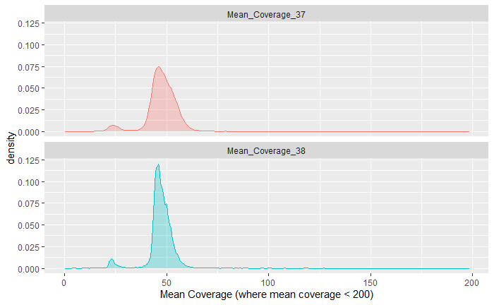

# Verification of DragenWGS v1.2.0

### ChangeLog

* Change .bam outputs to .cram
* SV calling now split by family
* Include SV annotation
* Added in configurations for running with GRCh38

### Recall and Precision

* As with the original validation, the GIAB sample HG001 was run through the pipeline and Recall and Precision were calculated using the Hap.py software [1]. The following command was used when using the Singularity version of hap.py (built from the Docker version):

For GRCh37:

```
singularity exec --bind /data /data/resources/envs/sifs/hap.py.sif /opt/hap.py/bin/hap.py /data/resources/human/giab/3.3.2/HG001_GRCh37_GIAB_highconf_CG-IllFB-IllGATKHC-Ion-10X-SOLID_CHROM1-X_v.3.3.2_highconf_PGandRTGphasetransfer.vcf.gz $vcf -f /data/resources/human/giab/3.3.2/HG001_GRCh37_GIAB_highconf_CG-IllFB-IllGATKHC-Ion-10X-SOLID_CHROM1-X_v.3.3.2_highconf_nosomaticdel.bed -o $out -r /data/resources/human/gatk/2.8/b37/human_g1k_v37.fasta
```

For GRCh38:
```
singularity exec --bind /data /data/resources/envs/sifs/hap.py.sif /opt/hap.py/bin/hap.py /data/resources/human/giab/3.3.2/HG001_GRCh38_GIAB_highconf_CG-IllFB-IllGATKHC-Ion-10X-SOLID_CHROM1-X_v.3.3.2_highconf_PGandRTGphasetransfer.vcf.gz $vcf -f /data/resources/human/giab/3.3.2/HG001_GRCh38_GIAB_highconf_CG-IllFB-IllGATKHC-Ion-10X-SOLID_CHROM1-X_v.3.3.2_highconf_nosomaticdel_noCENorHET7.bed -o $out -r /data/resources/human/gatk/v0/hg38/Homo_sapiens_assembly38.fasta
```

For use with the same reference genome as previous validations, the precision and recall values were identical. 

### CRAM Usability

* Use of CRAM output files with IGV were tested to ensure that artefact checking was not impacted by the change.  

### Coverage 

* Coverage of genes was compared between GRCh37 and GRCh38 across seven samples including the GIAB sample HG001. This was calculated using GATK4 [2] DepthOfCoverage followed by [CoverageCalculatorPy](https://github.com/AWGL/CoverageCalculatorPy).

* In all cases, average coverage of genes increased with use of GRCh38. 

Sample | Mean Coverage GRCh37 | Mean Coverage GRCh38
--------|----------------------|---------------------
GIAB | 50.38 | 56.18
Sample 1 | 43.93 | 45.99
Sample 2 | 56.56 | 58.96
Sample 3 | 53.79 | 56.14
Sample 4 | 47.27 | 48.97
Sample 5 | 74.84 | 77.51
Sample 6 | 63.59 | 66.10

* The distribution of average coverage did not differ significantly (shown by three representative samples).

**GIAB Sample**


**Patient Sample 1


**Patient Sample 2


* 889 genes were identified with coverage differences between GRCh37 and GRCh38 across the seven samples, with 236 of these genes consistently differing in >50% of samples. Of these 236, 46 had decreased coverage in GRCh38. 

### References

[1] https://github.com/Illumina/hap.py

[2] https://gatk.broadinstitute.org/hc/en-us

